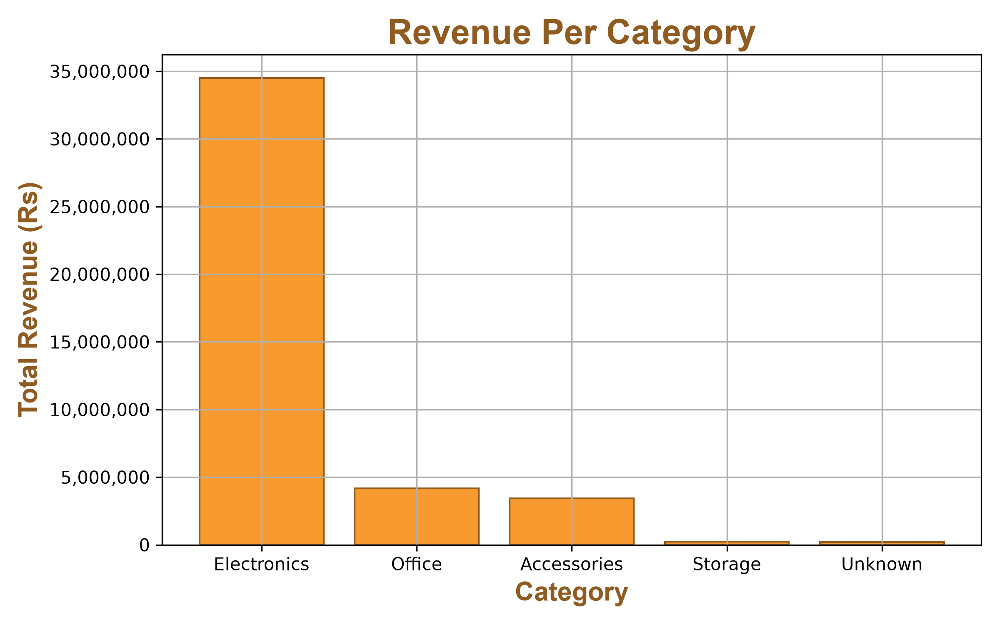
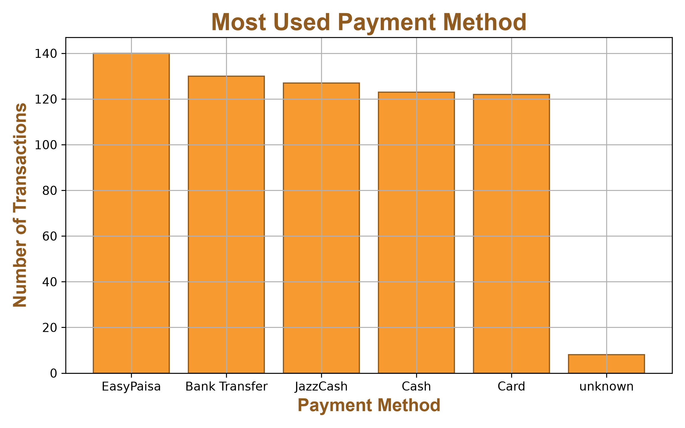
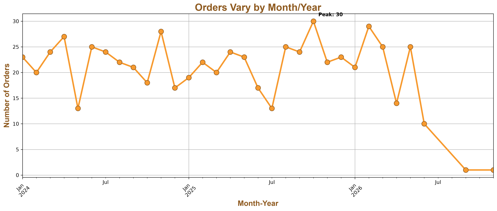
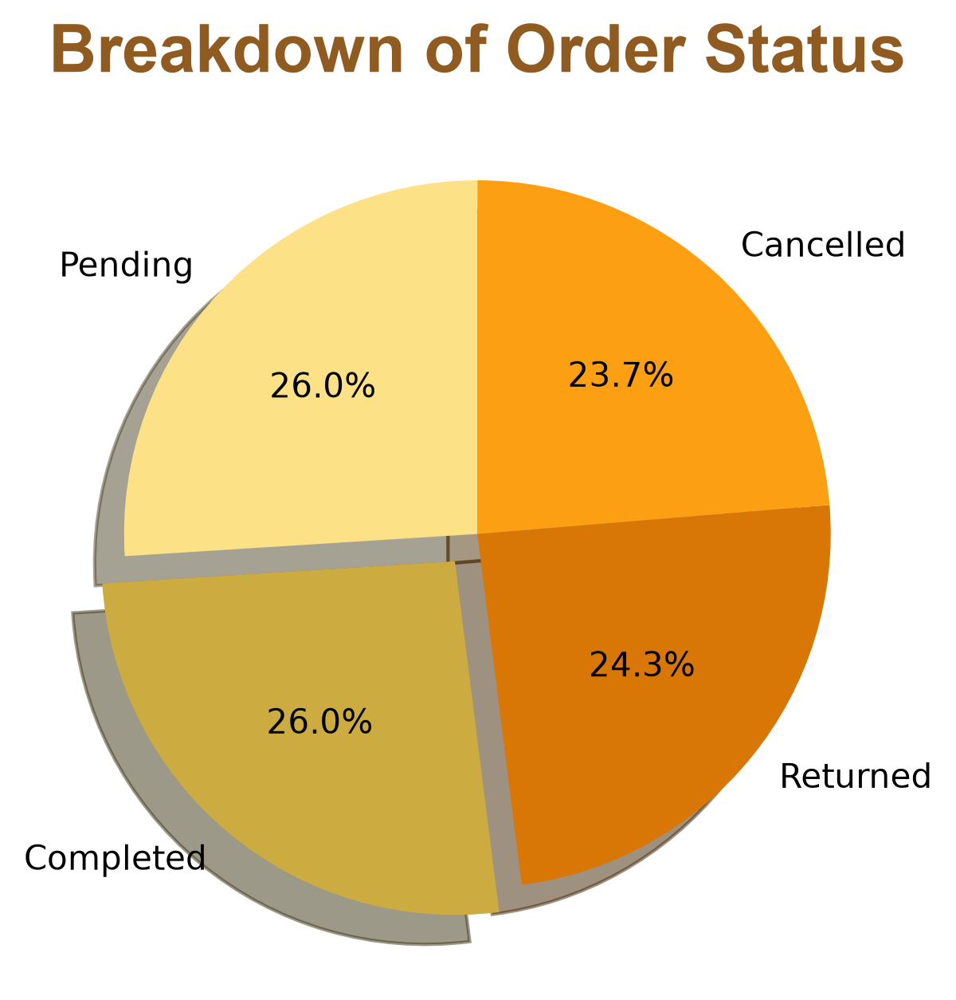

# 📊 E-commerce Data Cleaning & Visualization

An end-to-end data project: cleaning a messy e-commerce dataset and turning it into clear, 
insight-driven visualizations using Python.

## 📁 Project Structure
ecommerce-data-project/
├── data/
│   ├── messy_ecommerce_data.csv
│   └── cleaned_ecommerce_data.csv
├── images/
│   ├── revenue_per_category.png
│   ├── most_used_payment_method.png
│   ├── orders_vary_by_month_year.png
│   └── breakdown_of_order_status.png
├── 01_data_cleaning.ipynb
├── 02_data_visualization.ipynb
└── README.md
## 🛠️ Tools Used

- **Python**
- **Pandas** — data cleaning, transformation, and aggregation
- **Matplotlib** — data visualization
- **Jupyter Notebook**

## 🧹 Data Cleaning (`01_data_cleaning.ipynb`)

Cleaned a raw, messy e-commerce dataset (~663 rows) by handling:
- Missing values (group-based median imputation)
- Incorrect data types
- Outlier detection
- Regex-based text cleaning
- Categorical value standardization
- Datetime conversion

## 📈 Data Visualization (`02_data_visualization.ipynb`)

Explored the cleaned dataset to answer real business questions, visualized with customized 
matplotlib charts (titles, labels, colors, gridlines, annotations).

### Key Insights

**Revenue by Category**
Electronics generates approximately Rs 34.5 million in revenue — over 8x more than the next 
highest category, Office (~Rs 4.18 million). Storage and Unknown combined contribute less than 
Rs 450,000, showing revenue is heavily concentrated in one category.

**Most Used Payment Method**
EasyPaisa leads with 140 transactions, followed closely by Bank Transfer (130), JazzCash (127), 
Cash (123), and Card (122) — usage is fairly balanced across the top five methods.

**Orders Over Time**
Monthly order volume fluctuated between roughly 13 and 30 orders with no strong seasonal pattern. 
A drop-off in the final months reflects incomplete data at the edge of the dataset rather than a 
real business decline.

**Order Status Breakdown**
Order outcomes are nearly evenly split — Completed and Pending each at 26.0%, Returned at 24.3%, 
and Cancelled at 23.7% — showing no single outcome dominates.

## 🔍 About the Data

A sample e-commerce dataset used to practice and demonstrate the full workflow — from raw, messy 
data to clean data to actionable visual insights.

